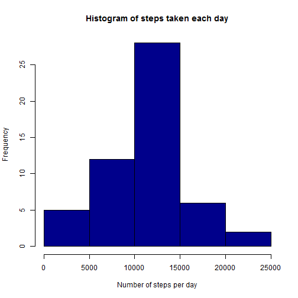

Personal Activity Monitoring
===================================

###Loading and preprocessing the data  
Show any code that is needed to  
1.  Load the data (i.e. read.csv())  

- Set the working directory and load the data into a data frame called "activity"

```r
setwd("C:/Users/v-drapop/Documents/Coursera/DataScience/ReproducibleResearch")
activity <- read.csv("activity.csv")
```


2.	Process/transform the data (if necessary) into a format suitable for your analysis  
- Convert intervals to factors, format dates as proper dates

```r
activity$interval <- factor(activity$interval)
activity$date <- as.Date(activity$date, format="%Y-%m-%d")
str(activity)
```

```
## 'data.frame':	17568 obs. of  3 variables:
##  $ steps   : int  NA NA NA NA NA NA NA NA NA NA ...
##  $ date    : Date, format: "2012-10-01" "2012-10-01" ...
##  $ interval: Factor w/ 288 levels "0","5","10","15",..: 1 2 3 4 5 6 7 8 9 10 ...
```


###What is mean total number of steps taken per day?
For this part of the assignment, you can ignore the missing values in the dataset.

1.  Make a histogram of the total number of steps taken each day.  
- Notice: I want to show this as a number of steps walked each day, not as a frequency of occurencies of steps walked, therefore I am using the barplot function, not the histogram function.


```r
stepsDay <- aggregate(steps ~ date, data = activity, FUN = sum)
barplot(stepsDay$steps, names.arg = stepsDay$date, col = "darkblue", main = "Histogram of steps taken each day", xlab = "Date", ylab = "Number of steps per day")
```

 

2.	Calculate and report the mean and median total number of steps taken per day  
- Mean total number of steps is:


```r
mean(stepsDay$steps)
```

```
## [1] 10766.19
```

- Median total number of steps is:


```r
median(stepsDay$steps)
```

```
## [1] 10765
```

###What is the average daily activity pattern?
1. Make a time series plot (i.e. type = "l") of the 5-minute interval (x-axis) and the average number of steps taken, averaged across all days (y-axis)


```r
stepsInterval <- aggregate(steps ~ interval, data = activity, FUN = mean, na.rm = TRUE)
plot(stepsInterval$interval,stepsInterval$steps, type="l", col = "darkblue", xlab="Daily interval", ylab="Number of steps per interval",main="Average daily activity pattern")
lines(stepsInterval$interval,stepsInterval$steps, col = "darkblue", xlab="Daily interval", ylab="Number of steps per interval",main="Average daily activity pattern")
```

 


2. Which 5-minute interval, on average across all the days in the dataset, contains the maximum number of steps?  
- The interval that contains the maximum number of steps is:


```r
maxSteps <- stepsInterval[which.max(stepsInterval$steps),1]
maxSteps
```

```
## [1] 835
## 288 Levels: 0 5 10 15 20 25 30 35 40 45 50 55 100 105 110 115 120 ... 2355
```

###Imputing missing values
Note that there are a number of days/intervals where there are missing values (coded as NA). The presence of missing days may introduce bias into some calculations or summaries of the data.  

1. Calculate and report the total number of missing values in the dataset (i.e. the total number of rows with NAs).  

- The total number of rows with NA values is:


```r
activityMissing <- sum(!complete.cases(activity))
activityMissing
```

```
## [1] 2304
```

2. Devise a strategy for filling in all of the missing values in the dataset. The strategy does not need to be sophisticated. For example, you could use the mean/median for that day, or the mean for that 5-minute interval, etc.  
- For any interval with missing values, I will use the average calculated across all days in the dataset for that particular interval.


3. Create a new dataset that is equal to the original dataset but with the missing data filled in.  


```r
library(Hmisc)
activityFillIn <- activity
activityFillIn$steps <- with(activityFillIn, impute(steps, mean))
```


4. Make a histogram of the total number of steps taken each day and calculate and report the mean and median total number of steps taken per day. Do these values differ from the estimates from the first part of the assignment? What is the impact of imputing missing data on the estimates of the total daily number of steps?  
- Notice: just as for the first histogram shown above, I want to show this as a number of steps walked each day, not as a frequency of occurencies of steps walked, therefore I am using the barplot function, not the histogram function.


```r
stepsDayF <- aggregate(steps ~ date, data = activityFillIn, FUN = sum)
barplot(stepsDayF$steps, names.arg = stepsDayF$date, col = "darkblue", main = "Histogram of steps taken each day, filled in missing data", xlab = "Date", ylab = "Number of steps per day")
```

 

- Mean total number of steps, with missing data filled in, is:


```
## [1] 10766.19
```
...which is identical to the mean total number of steps in the original data.  

- Median total number of steps, with missing data filled in, is:


```
## [1] 10766.19
```
...which is very close to the mean total number of steps in the original data.  

- Therefore we can conclude that the impact of imputing missing data on the estimates of the total daily number of steps is minimal.  


###Are there differences in activity patterns between weekdays and weekends?
For this part the weekdays() function may be of some help here. Use the dataset with the filled-in missing values for this part.  
1. Create a new factor variable in the dataset with two levels -- "weekday" and "weekend" indicating whether a given date is a weekday or weekend day.


```r
dayType <- function(date) {
    if (weekdays(date) %in% c("Saturday", "Sunday")) {
        return("weekend")
    } else {
        return("weekday")
    }
}
```


2. Make a panel plot containing a time series plot (i.e. type = "l") of the 5-minute interval (x-axis) and the average number of steps taken, averaged across all weekday days or weekend days (y-axis).


```r
activityFillIn$dayType <- as.factor(sapply(activityFillIn$date, dayType))
stepsByDay <- aggregate(steps ~ interval + dayType, data = activityFillIn, mean)
names(stepsByDay) <- c("interval", "dayType", "steps")

library(lattice)
xyplot(steps ~ interval | dayType, stepsByDay, type = "l", layout = c(1, 2), 
    xlab = "Interval", ylab = "Number of steps")
```

 

- After examining the plots of the average number of steps for weekend vs. weekdays, we can conclude that the highest overall activity occurs on weekday mornings, around 8:30, followed by moderate overall activity during the day on weekdays. The person likely runs in the morning and works in an occupation that is not sedentary.

- On weekends there are multiple peaks of activity throughout the day, although not quite as high as weekday mornings, but at the same time higher than rest of the day on weekdays. The person probably leads a fairly active lifestyle, either practicing sports or hiking/walking for most of the day on weekends.
